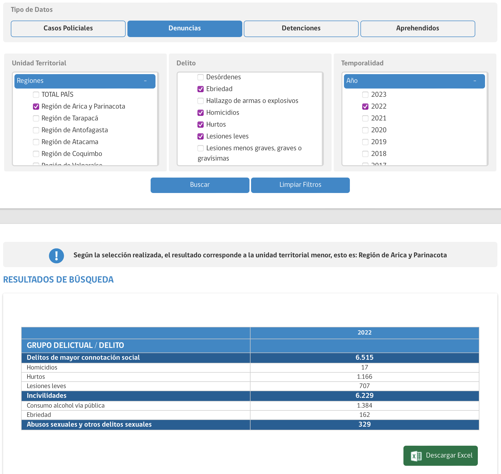
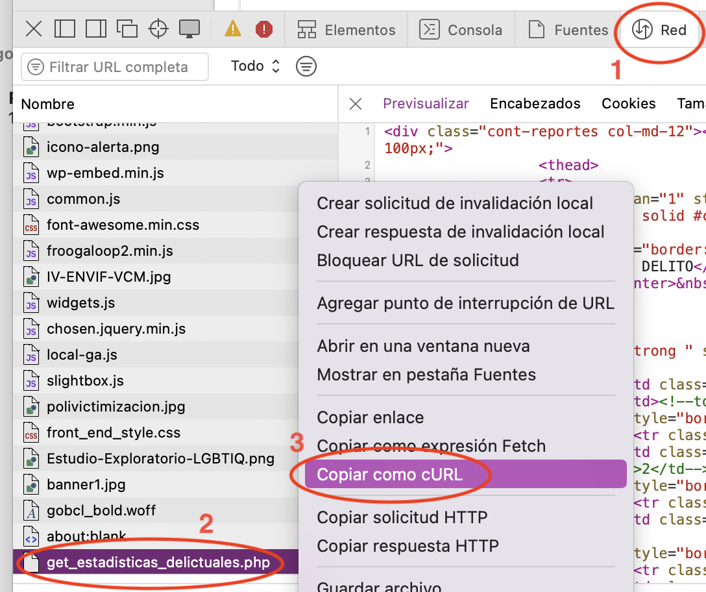

```{r setup, include=FALSE}
knitr::opts_chunk$set(echo = TRUE)
library(dplyr) #manipulación de datos
library(rvest) #web scraping
library(RCurl) #solicitudes http con curl
library(purrr) #for loops
library(janitor) #limpieza de datos
```

En este script detallaré cómo descargar datos de estadísticas delictuales del Centro de Estudios y Análisis del Delito (CEAD) de Chile utilizando técnicas de web scraping en R. Las estadísticas disponibles en el sitio web de CEAD corresponden a los siguientes datos oficiales: *Estadísticas Oficiales de Delitos de Mayor Connotación Social (DMCS), Violencia Intrafamiliar (VIF), Incivilidades y otros hechos informados por Carabineros y la Policía de Investigaciones de Chile al Ministerio del Interior y Seguridad Pública.*

El proceso implica analizar el funcionamiento del sitio web de CEAD para poder replicar su método de solicitud de datos en R, y así acceder de forma directa en R a los datos que necesitemos desde el sitio, sin necesidad de entrar al sitio web ni realizar operaciones manuales. Esto resulta conveniente dado que puede ser engorroso utilizar la interfaz del sitio web de CEAD para obtener los datos manualmente, o bien, si se necesita obtener un gran volumen de datos desde el sitio. Por lo demás, obtener los datos de forma manual mediante el sitio web no es una práctica reproducible, mientras que siguiendo estas instrucciones obtenemos un conjunto de funciones que hacen que el proceso de obtención de estadísticas delictuales sea automático, reproducible y sencillo.


## Funcionamiento del sitio web del CEAD

El sitio web del CEAD ofrece una interfaz web donde se pueden obtener tablas con datos delictuales por comuna o región, para los delitos o grupos de delitos especificados, y para los años que se le indique. Luego de hacer selecciones para obtener los datos en el sitio de CEAD, podemos ingresar al inspector web de nuestro navegador, y en el apartado de *red* podemos identificar en el documento `get_estadisticas_delictuales.php` que las selecciones que hicimos se traducen en una solicitud XML que se envía al servidor de CEAD y retorna los datos correspondientes.

A modo de ejemplo, realicemos una selección sencilla en la web de CEAD:



En el inspector web del navegador (en este caso Safari), vamos a *red*, identificamos `get_estadisticas_delictuales.php`, y en el menú contextual elegimos `copiar como cURL` para ver la solicitud que se envió al servidor de CEAD para obtener los datos:



Adjunto un ejemplo de cURL:
``` xml
curl 'https://cead.spd.gov.cl/wp-content/themes/gobcl-wp-master/data/get_estadisticas_delictuales.php'-X 'POST'-H 'Content-Type: application/x-www-form-urlencoded; charset=UTF-8'-H 'Accept: /'-H 'Sec-Fetch-Site: same-origin'-H 'Accept-Language: es-419,es;q=0.9'-H 'Accept-Encoding: gzip, deflate, br'-H 'Sec-Fetch-Mode: cors'-H 'Host: cead.spd.gov.cl'-H 'Origin: https://cead.spd.gov.cl'-H 'Content-Length: 674'-H 'User-Agent: Mozilla/5.0 (Macintosh; Intel Mac OS X 10_15_7) AppleWebKit/605.1.15 (KHTML, like Gecko) Version/16.6 Safari/605.1.15'-H 'Referer: https://cead.spd.gov.cl/estadisticas-delictuales/'-H 'Connection: keep-alive'-H 'Sec-Fetch-Dest: empty'-H 'Cookie: _ga=GA1.3.359881599.1695818071; _gid=GA1.3.1925657744.1695818071; PHPSESSID=p580t8bid8coo6gk46bg7i1162'-H 'X-Requested-With: XMLHttpRequest'–data 'medida=1&tipoVal=2&anio%5B%5D=2022&delitos_agrupados%5B%5D=2&delitos_agrupados%5B%5D=4&delitos_agrupados%5B%5D=3&delitos_agrupados_nombres%5B%5D=Abusos+sexuales+y+otros+delitos+sexuales&delitos_agrupados_nombres%5B%5D=Incivilidades&delitos_agrupados_nombres%5B%5D=Delitos+de+mayor+connotaci%C3%B3n+social&delitos%5B%5D=17&delitos%5B%5D=3&delitos%5B%5D=4&delitos%5B%5D=5&delitos%5B%5D=20&delitos_nombres%5B%5D=Consumo+alcohol+v%C3%ADa+p%C3%BAblica&delitos_nombres%5B%5D=Homicidios&delitos_nombres%5B%5D=Hurtos&delitos_nombres%5B%5D=Lesiones+leves&delitos_nombres%5B%5D=Ebriedad&region%5B%5D=15&region_nombres%5B%5D=Regi%C3%B3n+de+Arica+y+Parinacota&seleccion=2&descarga=false'
```

Nuestro objetivo, entonces, es replicar esta solicitud en R para obtener los datos sin tener que usar la interfaz web de CEAD.


## Crear solicitud de datos

Podemos notar que la solicitud cURL se divide, a grandes rasgos, en una primera sección con el año seleccionado (`&anio%5B%5D=2022`), luego los delitos elegidos (`&delitos_agrupados_nombres%5B%5D=Abusos+sexuales+y+otros+delitos+sexuales...`), y una sección final donde se define la unidad geográfica correspondiente (`&region%5B%5D=15&region_nombres%5B%5D=Regi%C3%B3n+de+Arica+y+Parinacota`). Por lo tanto, utilizando R podemos replicar una solicitud de un conjunto de delitos copiando el texto que genera la aplicación web de CEAD, y cambiando los parámetros que necesitemos; en este caso, el año y la comuna.

Realizando previamente una solicitud en el sitio de CEAD, podemos seleccionar los delitos que nos interesen, y copiar la solicitud generada, aislando el texto que corresponde a los delitos, como vemos a continuación:

```         
&delitos_agrupados%5B%5D=3&delitos_agrupados%5B%5D=7&delitos_agrupados_nombres%5B%5D=Delitos+de+mayor+connotaci%C3%B3n+social&delitos_agrupados_nombres%5B%5D=Robo+frustrado&delitos%5B%5D=8&delitos%5B%5D=10&delitos%5B%5D=9&delitos%5B%5D=11&delitos%5B%5D=12&delitos%5B%5D=30&delitos%5B%5D=13&delitos%5B%5D=7&delitos%5B%5D=4&delitos_nombres%5B%5D=Robo+con+violencia+o+intimidaci%C3%B3n&delitos_nombres%5B%5D=Robo+de+veh%C3%ADculo+motorizado&delitos_nombres%5B%5D=Robo+de+objetos+de+o+desde+veh%C3%ADculo&delitos_nombres%5B%5D=Robo+en+lugar+habitado&delitos_nombres%5B%5D=Robo+en+lugar+no+habitado&delitos_nombres%5B%5D=Robo+frustrado&delitos_nombres%5B%5D=Robo+por+sorpresa&delitos_nombres%5B%5D=Otros+robos+con+fuerza&delitos_nombres%5B%5D=Hurtos
```

Puedes usar este mismo texto para realizar tu propia request de delitos relacionados a robos, o bien, puedes realizar tu propia selección de delitos/infracciones/incivilidades en el sitio del CEAD y copiar el texto usando el inspector web de tu navegador, teniendo cuidado de extraer el texto correcto y completo, es decir, desde que dice `&delitos_agrupados` después del año, hasta que diga el último delito antes de decir `&region`.

Por ejemplo, otra string que seleccionaría los delitos de violencia intrafamiliar y violencia sexual sería la siguiente: `&delitos_agrupados%5B%5D=2&delitos_agrupados%5B%5D=8&delitos_agrupados_nombres%5B%5D=Abusos+sexuales+y+otros+delitos+sexuales&delitos_agrupados_nombres%5B%5D=Violencia+intrafamiliar`.

Con esta información, creamos una función en R donde repliquemos la solicitud/request que nos interesa, definiendo que queremos obtener la información a escala mensual, con argumentos para poder definir el año y comuna que necesitamos:

```{r funcion_request}
cead_generar_request <- function(año_elegido, comuna_numero) {
  
  # todos los meses del año
  request_fechas = "&trimestre%5B%5D=1&trimestre%5B%5D=2&trimestre%5B%5D=3&trimestre%5B%5D=4&mes%5B%5D=1&mes%5B%5D=2&mes%5B%5D=3&mes%5B%5D=4&mes%5B%5D=5&mes%5B%5D=6&mes%5B%5D=7&mes%5B%5D=8&mes%5B%5D=9&mes%5B%5D=10&mes%5B%5D=11&mes%5B%5D=12&mes_nombres%5B%5D=Enero&mes_nombres%5B%5D=Febrero&mes_nombres%5B%5D=Marzo&mes_nombres%5B%5D=Abril&mes_nombres%5B%5D=Mayo&mes_nombres%5B%5D=Junio&mes_nombres%5B%5D=Julio&mes_nombres%5B%5D=Agosto&mes_nombres%5B%5D=Septiembre&mes_nombres%5B%5D=Octubre&mes_nombres%5B%5D=Noviembre&mes_nombres%5B%5D=Diciembre"
  
  # delitos copiados desde una request anterior
    request_delitos = "&delitos_agrupados%5B%5D=3&delitos_agrupados%5B%5D=7&delitos_agrupados_nombres%5B%5D=Delitos+de+mayor+connotaci%C3%B3n+social&delitos_agrupados_nombres%5B%5D=Robo+frustrado&delitos%5B%5D=8&delitos%5B%5D=10&delitos%5B%5D=9&delitos%5B%5D=11&delitos%5B%5D=12&delitos%5B%5D=30&delitos%5B%5D=13&delitos%5B%5D=7&delitos%5B%5D=4&delitos_nombres%5B%5D=Robo+con+violencia+o+intimidaci%C3%B3n&delitos_nombres%5B%5D=Robo+de+veh%C3%ADculo+motorizado&delitos_nombres%5B%5D=Robo+de+objetos+de+o+desde+veh%C3%ADculo&delitos_nombres%5B%5D=Robo+en+lugar+habitado&delitos_nombres%5B%5D=Robo+en+lugar+no+habitado&delitos_nombres%5B%5D=Robo+frustrado&delitos_nombres%5B%5D=Robo+por+sorpresa&delitos_nombres%5B%5D=Otros+robos+con+fuerza&delitos_nombres%5B%5D=Hurtos"
  
  # unir fragmentos en una sola request
  request <-  paste0("medida=1&tipoVal=2",
                    "&anio%5B%5D=", año_elegido, request_fechas, 
                    request_delitos,
                    "&comuna%5B%5D=", comuna_numero, 
                    "&seleccion=2&descarga=false"
                    )
  return(request)
}
```

A continuación, realizamos una prueba con esta función para crear una solicitud para el año 2022, usando el código único territorial o CUT de una comuna de prueba, en este caso, La Florida. Los códigos únicos territoriales de las comunas podemos obtenerlos del [sitio web de la Infraestructura de Datos Geoespaciales de Chile](https://www.ide.cl/index.php/limites-y-fronteras/item/1532-planilla-codigos-unicos-territoriales-cut) (IDE Chile) u otros (personalmente, suelo crear una función que al ingreasrle el nombre de una comuna me retorne el CUT de la misma). 

```{r generar_request}
request_prueba = cead_generar_request(año_elegido = 2022, 
                                      comuna_numero = 13110)

print(request_prueba)
```

De este modo, creamos una solicitud que simula a un usuario que accedió al sitio web de CEAD, realizó selecciones en los distintos apartados de delitos, comunas y años, y presionó el botón "Buscar".

## Realizar solicitud de datos 

Teniendo nuestra solicitud hecha, basta con enviarla al servidor para recibir los datos de vuelta, tal como si hubiésemos entrado al sitio, seleccionado las opciones y presionado el botón para obtener datos. Para ello, creamos una nueva función que envía al servidor la solicitud que creamos:

```{r funcion_realizar_request}
cead_realizar_request <- function(request) {
  RCurl::getURL(url = "https://cead.spd.gov.cl/wp-content/themes/gobcl-wp-master/data/get_estadisticas_delictuales.php",
         postfields = request,
         httpheader = c(Connection = "close", 
                        'Content-Type' = "application/x-www-form-urlencoded; charset=UTF-8", 
                        'Content-length' = nchar(request)
         )
  )
}
```

Entonces, aplicamos la solicitud que creamos a la función para realizar la solicitud, y así obtendremos datos desde el servidor de CEAD. Cuidado, que esta función lleva a cabo una conexión web con el servidor de CEAD, por lo que debemos ser responsables y precavidos con la cantidad de veces que la ejecutamos, y con no solicitar demasiados datos, dado que estamos obteniendo datos de manera gratuita y no queremos causar inconvenientes para otros usuarios, por ejemplo, realizando cientos de requests por minuto.

```{r obtener_datos, cache=TRUE}
datos_prueba <- cead_realizar_request(request_prueba) #ejecutar solo cuando sea necesario, para no saturar el servidor CEAD

datos_prueba |> substr(1, 400) 
```

Sin embargo, los datos que recibimos vienen en formato HTML. Para transformarlos en datos legibles, usamos el paquete `{rvest}` para transformar el HTML a un data frame:

```{r limpiar_datos}
#obtener y limpiar datos html usando rvest
datos_prueba_2 <- datos_prueba |> 
  rvest::read_html() |> #leer datos html
    rvest::html_table() |> #extraer tabla desde el código
    purrr::pluck(1) |> #sacar de la lista
    janitor::row_to_names(2) |> #usar segunda fila como nombre de columnas
    rename(delitos = 1) #renombrar primera columna

print(datos_prueba_2)
```

Listo! Hemos obtenido los datos de delitos directamente del sitio del CEAD desde R. Para finalizar, realizamos una pequeña manipulación de los datos para transformarlos a formato `tidy`, es decir, una observación por fila:

```{r ordenar_datos}
datos_prueba_3 <- datos_prueba_2 |> 
 tidyr::pivot_longer(cols = 2:length(datos_prueba_2), names_to = "mes", values_to = "cifra") |> #pivotar a formato long
  mutate(fecha = lubridate::ymd(paste("2022", mes, "1"))) |> #crear fecha a partir del mes
  select(fecha, delito = delitos, delito_n = cifra) |>
  mutate(delito_n = as.numeric(delito_n)) |> 
  arrange(delito, desc(fecha))

head(datos_prueba_3, 20)
```

## Ejecutar para varias comunas y/o años

Ahora, probablemente queramos obtener datos para un rango de años más amplio, y quizás para varias comunas. Para ello, podemos realizar un loop que aplique la función que creamos consecutivamente a partir de un vector de años y de comunas, a modo de realizar varias solicitudes de una sola vez.

Usando como ejemplo 4 códigos únicos territoriales y un vector de 5 años, realizamos un loop usando `{purrr}` que realice las solicitudes al CEAD, procurando mantener un ritmo de scraping que sea respetuoso de la fuente de datos. Notamos que el loop tiene dos niveles: por cada comuna, realiza otro loop para todos los años. Esto también se puede realizar en un solo loop con la función `map2()`\` , pero personalmente encuentro que usar un loop dentro de otro es más intuitivo.

```{r loop_scraping, cache=TRUE}
#definir comunas y años que queremos scrapear
comunas_por_calcular = c(14104, 13110, 13112, 05604) |> set_names()
años_elegidos = 2018:2022 |> set_names()
  
#loop por cada comuna
datos_cead <- map(comunas_por_calcular, \(comuna_numero) {
  message("inciando comuna ", comuna_numero)
  
  #loop dentro del loop: para la comuna, por cada año especificado
  data_comuna <- map(años_elegidos, \(año) {
    message("año ", año)
    
    #generar request
    xml.request = cead_generar_request(año_elegido = año, 
                                       comuna_numero)
    
    #obtener datos usando la función de request
    inicio = Sys.time()
    data_año = cead_realizar_request(xml.request)
    final = Sys.time()
    #dar tiempo de espera en base al tiempo que tomó descargar los datos, para no saturar el servidor
    Sys.sleep((final-inicio)*10)
    
    return(data_año)
  })
  return(data_comuna)
})

datos_cead |> substr(1, 400)
```
Esto puede tomar un par de minutos. En todo caso, el código va arrojando mensajes en la consola para que no pensemos que se quedó pegado.

Posteriormente, realizamos el mismo proceso de limpieza de datos que antes, obteniendo las tablas desde el código html que retornó el CEAD, y ordenamos los datos en formato tidy, donde cada variable es una columna y cada observación es una fila. Ojo, que este loop recorre los datos obtenidos en el paso anterior en base al vector de comunas que usamos para obtener los datos, `comunas_por_calcular`, ya que los datos fueron recibidos como una lista donde cada elemento de la lista tiene como título el código de la comuna.

```{r loop_limpieza}

#por cada comuna
cead_limpiada <- map_df(comunas_por_calcular, \(.comuna) {
  # message("obteniendo comuna ", .comuna)
  
  #extraer la comuna desde los datos usando el nombre de cada elemento de la lista
  cead_comuna <- datos_cead |> 
    pluck(as.character(.comuna))
  
  #por cada año, usando los nombres del objeto anterior, dado que cada comuna es, a su vez, una lista cuyos elementos son los años obtenidos para esa comuna
  datos_comuna_año <- map(names(cead_comuna), \(.año) {
    # message("obteniendo año ", .año)
    
    #obtener tablas
    cead_comuna_año <- cead_comuna |> 
      pluck(.año) |>
      rvest::read_html() |> 
    rvest::html_table() |> 
    purrr::pluck(1) |> 
    janitor::row_to_names(2) |> 
    rename(delitos = 1)
    
    #pivotar a formato tidy (una observación por fila)
    cead_datos <- cead_comuna_año |> 
      tidyr::pivot_longer(cols = 2:length(cead_comuna_año), names_to = "mes", values_to = "cifra") |> 
      mutate(año = .año, comuna = .comuna) |> 
      mutate(fecha = lubridate::ymd(paste(año, mes, "1")))
    
    return(cead_datos)
  })
  return(datos_comuna_año)
})

head(cead_limpiada)
```

Listo, hemos obtenido los datos para las comunas que definimos y en los años que fijamos, y lo mejor es que podemos volver a usar este proceso para obtener los datos de cualquier comuna, o incluso de todas las comunas, de forma rápida y reproducible. Si bien hay otras formas de automatizar este tipo de procesos, considero que usando R resulta más confiable dado que nos comunicamos directamente con el funcionamiento de la plataforma web, y es bastante conveniente tener estos scripts en caso de que necesites replicar el proceso para otras comunas o rangos temporales.

----

**Bastián Olea Herrera**

Magíster en sociología, data scientist

https://bastian.olea.biz

Contacto: bastianolea arroba gmail punto com